<!-- Generated by GitHub Profile Agent Console. Edit profile.config.json, then run npm run generate. -->

  <picture>
    <source media="(max-width: 760px) and (prefers-color-scheme: dark)" srcset="./assets/hero/agent-console-e0c40415-mobile-dark.svg">
    <source media="(max-width: 760px)" srcset="./assets/hero/agent-console-e0c40415-mobile-light.svg">
    <source media="(prefers-color-scheme: dark)" srcset="./assets/hero/agent-console-e0c40415-dark.svg">
    <source media="(prefers-color-scheme: light)" srcset="./assets/hero/agent-console-e0c40415-light.svg">
    
  </picture>

  

## About Me

I'm an Aspiring Web Developer who enjoys turning ideas into working products — from frontend interfaces to backend systems and developer tooling.

I like building in public, learning new stacks, and shipping projects that solve real problems.

## Current Focus

| Area | What I am exploring |
| --- | --- |
| **Full-Stack Dev** | Building web applications from UI to API, deployment, and maintenance. |
| **Open Source** | Contributing to and maintaining public repositories on GitHub. |
| **Developer Tools** | Workflows, automation, and tools that make engineering faster. |

## Featured Work

| Project | Focus | Why it matters |
| --- | --- | --- |
| [**kennu-portfolio**](https://github.com/elnarkennu16-440/kennu-portfolio) | Personal portfolio | My personal portfolio site showcasing projects, skills, and experience. [Live](https://kennu-v1.vercel.app) |
| [**NobleClassics**](https://github.com/elnarkennu16-440/NobleClassics-Main) | E-commerce / PHP | Full-featured bookstore e-commerce with cart, checkout, and admin dashboard. |
| [**NCAMIS-SHS**](https://github.com/elnarkennu16-440/NCAMIS-SHS) | School management | Web-based academic and admin platform for Senior High School. |
| [**Bento Portfolio**](https://github.com/elnarkennu16-440/BENTO-GRID-PORTFOLIO-TEMPLATE-1---REACTJS) | React / UI design | Bento Grid portfolio with 3D tilt, glassmorphism, and Framer Motion. |

## Research Direction

I'm focused on building reliable software — clean architecture, practical tooling, and products that are useful in the real world.

## Tech Stack

`JavaScript` · `TypeScript` · `React` · `Node.js` · `PHP` · `Tailwind CSS` · `Git`

## Recent Activity

<!-- AUTO:ACTIVITY:START -->
_Recent public activity will appear here after the workflow runs._
<!-- AUTO:ACTIVITY:END -->

---

  Building software, sharing what I learn, and shipping useful projects.

