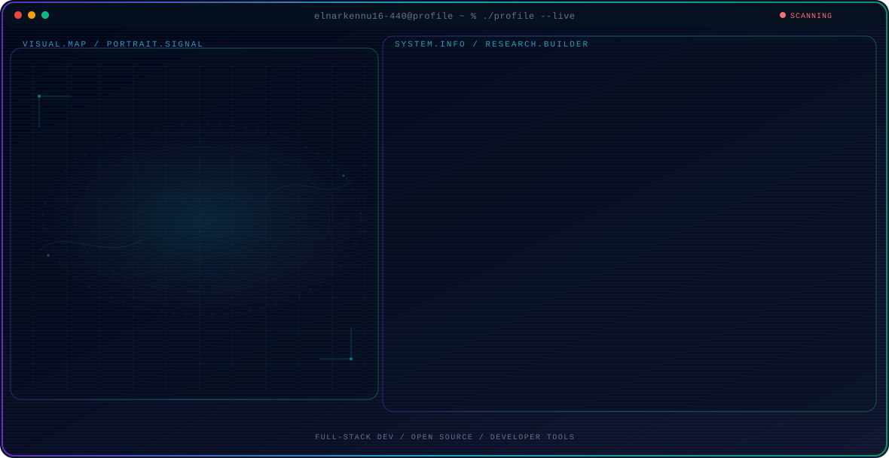

<!-- Generated by GitHub Profile Agent Console. Edit profile.config.json, then run npm run generate. -->

  <picture>
    <source media="(max-width: 760px) and (prefers-color-scheme: dark)" srcset="./assets/hero/agent-console-e0c40415-mobile-dark.svg">
    <source media="(max-width: 760px)" srcset="./assets/hero/agent-console-e0c40415-mobile-light.svg">
    <source media="(prefers-color-scheme: dark)" srcset="./assets/hero/agent-console-e0c40415-dark.svg">
    <source media="(prefers-color-scheme: light)" srcset="./assets/hero/agent-console-e0c40415-light.svg">
    
  </picture>

  

## About Me

I’m Kennu, an Information Systems graduate and builder based in the Philippines. I focus on developing clean web interfaces, exploring practical backend logic, and testing software workflows to ensure applications run reliably.

Whether building personal projects or running functional tests to catch edge cases, I value simple structure, consistent practice, and steady iteration.

## Current Focus

| Area | What I am exploring |
| --- | --- |
| **Web Development** | Building responsive interfaces and straightforward server-side systems. |
| **Quality & Testing** | Exploring manual testing, test scenarios, and automated checks to improve application stability. |
| **Practical Tooling** | Improving day-to-day Git workflows, database modeling, and structured development setups. |

## Featured Work

| Project | Focus | Why it matters |
| --- | --- | --- |
| [**MIRAMS Enterprise System**](https://github.com/elnarkennu16-440/MIRAMS-ENTERPRISE-SYSTEM) | React / Laravel / RBAC | Manufacturing asset tracking & request system with role-based access and multi-user workflows. |
| [**NCAMIS-SHS**](https://github.com/elnarkennu16-440/NCAMIS-SHS) | Academic Management | Web-based student management platform designed to streamline high school academic records. |
| [**NobleClassics**](https://github.com/elnarkennu16-440/NobleClassics-Main) | PHP / E-commerce | Online bookstore prototype covering catalog browsing, cart operations, and an admin dashboard. |
| [**Bento Portfolio**](https://github.com/elnarkennu16-440/BENTO-GRID-PORTFOLIO-TEMPLATE-1---REACTJS) | React / Tailwind CSS | Minimalist personal website layout focused on dark aesthetics, responsive cards, and clean typography. |
| [**3D Vision & Particle Demos**](https://github.com/elnarkennu16-440/MEDIAPIPE-THREEJS-HAND-TRACKING) | Python / Computer Vision | Interactive experiments exploring hand tracking and particle visualizations. |

## Practice & Direction

I approach software through both building and verification — ensuring features are straightforward to use, interfaces remain intuitive, and core functionalities work as expected across edge cases.

## Tech Stack & Tools

`JavaScript` · `TypeScript` · `React` · `Tailwind CSS` · `PHP` · `Laravel` · `MySQL` · `Git` · `Playwright / Testing Basics`

## Recent Activity

<!-- AUTO:ACTIVITY:START -->
_Recent public activity will appear here after the workflow runs._
<!-- AUTO:ACTIVITY:END -->

---

  Building practical tools, learning through iteration, and testing for reliability.

